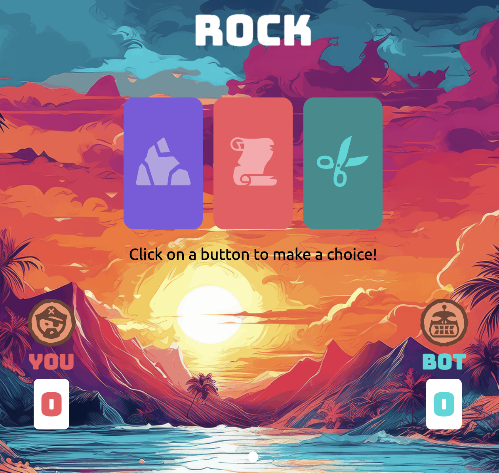

# Pirate vs Tiki Bot Rock-Paper-Scissors Project Documentation

## Overview

Pirate vs Tiki Bot Rock-Paper-Scissors project developed for the Foundations Certification through the Odin Project. This project uses JavaScript to power the game's functions, creating a playful and interactive experience with animations and a vibrant interface.

## Features

### Gameplay

- You, the Pirate, play a game of Rock-Paper-Scissors against the Tiki Bot.

- The game takes place on a deserted island, enhancing the thematic experience.

- Each round offers a chance-based outcome.

### Animations and Interface

- Dynamic animations enhance the gameplay experience.

- Vibrant interface elements create an engaging and playful environment.

- Visual feedback provided for game outcomes (win, lose, draw).

## Technologies Used

- **JavaScript**: Core functionality and game logic.

- **HTML/CSS**: Structure and styling of the game interface.

- **CSS Animations**: Animated elements for interactive gameplay.

## Game Mechanics

### Initialization

- Game starts with an introduction screen.

- Instructions provided for new players.

### Playing the Game

- Players choose Rock, Paper, or Scissors.

- Tiki Bot makes a random choice.

- JavaScript function determines the outcome based on standard Rock-Paper-Scissors rules.

### Animations

- Animations triggered based on player and Tiki Bot choices.

- Winning, losing, and drawing animations provide visual feedback.

### Interface Elements

- Buttons for player choices (Rock, Paper, Scissors).

- Display area shows results of each round.

- Scoreboard tracks the player's and Tiki Bot's scores.

## How to Play

1\. **Start the Game**: Open the game and read the introduction screen.

2\. **Make a Choice**: Select Rock, Paper, or Scissors by clicking the corresponding button.

3\. **View Results**: Watch the animations and see the result of the round.

4\. **Continue Playing**: Play additional rounds to try to beat the Tiki Bot.

## Project Setup

1\. Clone the repository from GitHub.

   

2\. Navigate to the project directory.

   

3\. Open `index.html` in a web browser to start the game.

## Contribution Guidelines

- Fork the repository.

- Create a new branch for your feature or bug fix.

- Submit a pull request with a detailed description of your changes.

## Contact Information

For questions or feedback, please visit the project maintainer's [GitHub page](https://github.com/alo77).